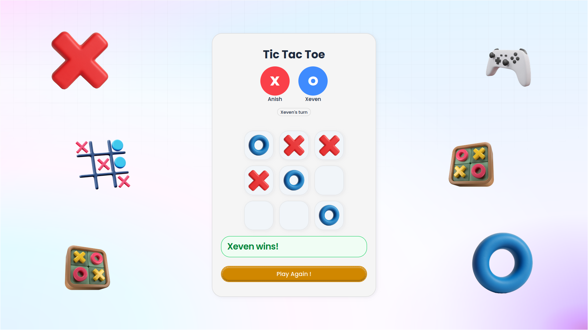

# Tic Tac Toe Online Game 🕹️

A real-time multiplayer Tic Tac Toe game built with React ⚛️, Node.js ⚙️, Express 🚀, Socket.IO 🌐, and TypeScript 🛡️. Play with your friends and have fun! 🎉



Link : [Tic-Tac-Toe](https://online-tictactoe7.netlify.app/)

## Tech Stack 💻

- **Frontend**: React, Vite, Tailwind CSS, Socket.IO Client
- **Backend**: Node.js, Express, Socket.IO, TypeScript

## Project Structure 📂

- `frontend/`: React frontend built with Vite
- `backend/`: Node.js backend with Socket.IO

## Development 🛠️

### Backend ⚙️

```bash
cd backend
bun install
bun run dev
```

### Frontend ⚛️

```bash
cd frontend
bun install
bun run dev
```
